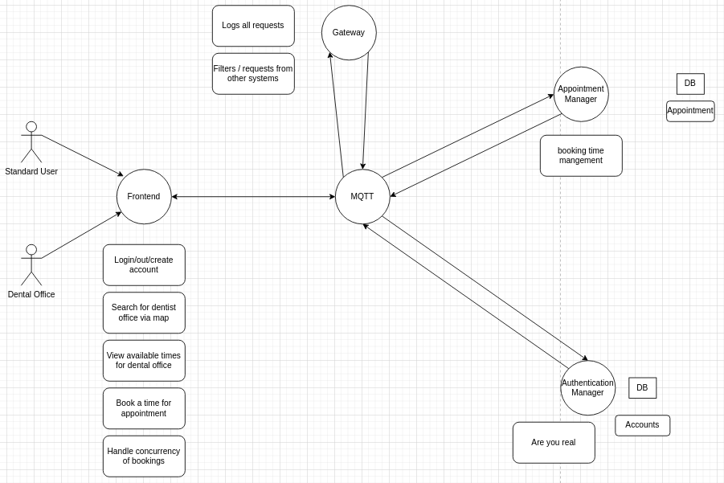

# Team 16 Project Documentation

## **Abstract** System Design

## Management details
- [Team Contract](./subdocs/TeamContract.md)
## Developers 

- [Drake Axelrod](https://git.chalmers.se/axelrod)
- [Christofer Jidarv](https://git.chalmers.se/Jidarv)
- [Simon Arvidsson](https://git.chalmers.se/simonar)
- [Klara Svensson](https://git.chalmers.se/klarasve)
- [Robin Hansen](https://git.chalmers.se/robinhan)
- [Johan Axell](https://git.chalmers.se/johanaxe)

## Team Resouces 

- [Trello](https://trello.com/b/Supm1hiE/dit355-group-16)
- [Discord](https://discord.gg/Xd6E9Nr2qP)
- [Gitlab]()
- [Appointment manager](https://git.chalmers.se/courses/dit355/test-teams-formation/team-16/team-16-project-booker)
- [User manager](https://git.chalmers.se/courses/dit355/test-teams-formation/team-16/team-16-project-authentication)
- [Frontend](https://git.chalmers.se/courses/dit355/test-teams-formation/team-16/frontend)
- [MQTT](https://git.chalmers.se/courses/dit355/test-teams-formation/team-16/team-16-project)
- [Gateway](https://git.chalmers.se/courses/dit355/test-teams-formation/team-16/team-16-gateway)

## Frontend

Our goal is to create an accessible and intuitive interface with functionality described below. It will support communication over the MQTT using protocoll using websockets. This will enable duplex and asynchronous communication with the the server while also removing the need to update the webpage in order to show an up-to-date visualisation of the current time slots available to the user. **should probably write something more here**

### user stories / requirements

1.1 Homepage:
    * The Homepage will mainly consist of a Map showing the different clinics while also providing options to login and register as a new user.

1.2 Map:
    * Should display the available clinics
        - When clinic icon is clicked, will show a card with information regarding the chosen clinic

1.3 Booking page:
    * Showing available and unavailable time slots

1.4  User account:
    * A user should be able to
        - Sign up
        - Sign in
        - Log out

1.5  Profile:
    * The profile page will provide the following:
        - Options to update user information
        - View current and past bookings

## MQTT

- We will be using MQTT as our network protocol. This will enable usage of a publish/subscribe model in order to transfer resources between different units. This transmission is utilizing our broker as a middleman to send and receive messages between the different subsystems. These messages are not sent to a specific receiver, instead they are tagged with a topic and a message, and only the subsystems interested, subscribed, to this specific topic will be receiving them.
Using this architecture style will facilitate our ability to be flexible, while also allowing for greater scalability. This is partly because the publish/subscribe model is asynchronous, but also because we are able to add or remove subscribers without much extra programming being needed.

### user stories / requirements

2.1 Should log all requests:

    * A logger will be implemented to mainly provide another way to troubleshoot while also giving  an extra perspective in regards to performance.

2.2 Uses its own database:

    * Promote modularity and further increase decoupling

2.3 Must be able to receive data from frontend:

    * As described above, the broker will be the middleman between the front- and the backend. It will track which subsystem is subscribed to what topic and so on.  

2.4 Generate backend requests from frontend request:

    * As soon as the front end publishes, eventually the backend should do the same to provide the requested resource back to where it was originally requested.

2.5 Must be able to send the backend request to the right subsystem:

## Appointment manager

The appointment manager will handle booking requests from users. It will handle the available and booked appointments for dentist clinics, along with associated data, such as patient information. This subsystem will mostly act on-demand and will be used when a user requests to see the available appointments. The subsystem will collaborate with the user-manager in order to book appointments and verify users' that wish to book an appointment.

### user stories / requirements

Frontend:
3.4 Booker database:
    *Create MongoDB database
    * The appointment object in the database should follow the schema
    * Basic routes

## User-manager

One part of the system will be handled by the user-manager. Said user-manager will handle the authentication and similar responsibilites related to user activities.
The user-manager will be used in collaboration with other subsystems to perfrom tasks, although this subsystem will be limited to its abilities and responsibilities.

The user manager handles the basic activites of users:
    *Login
    * Register
    *Logout
    * Authentication when requested
    * Retrieving user information when requested

The login feature is performed by passportjs, and the authentication feature is performed by a feature of passportjs(passport.session).
The user authentication will be performed on request from other subsystems, and once done, it will return a value through mqtt that can be handled and used to either accept or deny
tasks depending on the state of the returning value.

### user stories / requirements

4.1 User Database:
    *Create MongoDB database
    * The user object in the database should follow the user schema
    *The user schema should contain the following(with the possibility to add further things):
        - id (autogenerated/created manually)
        - email/username
        - password
    * Basic routes:
        - login
        - register
        - logout
        - get user by id
        - get all users
        - filter on email/name

In 4.1, we create a MongoDB database through Atlas, which primarily provides simplicity and reliability, due to us being able to share database servers and only require a connection string to connect and use the database.

4.2 User Authentication Upon Request:
    *Check and verify user's credentials (when user is logging in):
        - email/username
        - password
    * If no user account exists, return message to user and deny actions that requires an account.

In 4.2, the checking and verifying of user credentials are performed by passportJS, which handles the login and authentication of users. PassportJS provies a simple, yet effective, way to log in and authenticate users.

4.3 Cookies:
    *Create cookie if none is set in request header
    * Auth through cookie
    * User ID as one Cookie

4.4 Update Profile:
    *A user should be able to change user information
    * The changed information should be stored/updated in the db

4.5 Create account:
    *User account created with POST
    * User account adhere to schema

## Architectural drivers

### MQTT

One of our drivers are that we include MQTT and how we decided to design the implementation of it in our project. In our planned design, we decided to combine MQTT and the gateway broker into one unit, and thus can have them work together to fulfill their tasks. Considering that separating them would result in two smaller units, and likely also convolute the implementation of the communication between all units, including both of the respective units. As previously mentioned, we therefore decided to have them combined into one unit.
Due to the requirement to have at least four (4) independent systems, it can also be considered a constraint for us to combine them into one unit, and thus avoid having a system with few tasks and responsibilities.

### Programming languages

Our choice to use TypeScript for our frontend, can be consider as a constraint of our project. TypeScript happens to be relatively similar to JavaScript, which we have experience from a previous course, which makes the development phase less stressful, and less error-prone. In order to minimize the potential risks followed by being less experienced with a programming language, we decided to use TypeScript, which shares a lot of syntax from JavaScript.

We have also decided to use React, as well as Express. These programming languages are easy to learn, and contain plenty of functionality that we may use throughout the development phase.

### Choice of Databases

We have chosen to use MongoDB Atlas for our databases, which provides a simple, yet effective alternative to hosting our own databases. We also believe that MongoDB Atlas is reliable, and have experience using their service in a previous course, which results in less confusion on how it works and how it is involved in the development phase.
This does however require an internet connection, but due to the widespread use of the internet, along with little data consumption, it happens to be a constraint we as a group are acceptable with.

## Architectural styles

- The system will be event driven, using the publish/subscribe model. This means that in short, there will be event producers publishing messages to a topic to which one or mupltiple consumers are subscribed to. These consumers are independent of each other and are only subscribed the necessary topics. A broker is implemented to act as a middle man between the producers and consumers. The broker keeps track of which subsystem is subscribed to what topic. This style is well-suited for a distributed system where multiple subsystems has to process the same event. It also allows for real-time processing and better performance. Horizontal expansion of this system is also easily achived using this style.
